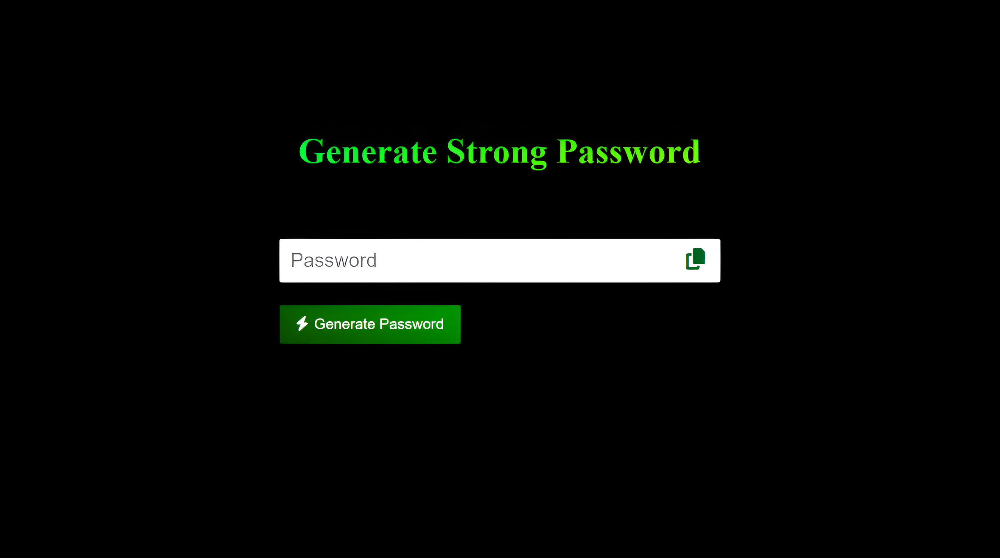

# Strong Password Generator 🔑  

A simple and secure **Strong Password Generator** built using **HTML**, **CSS**, and **JavaScript**. This tool helps users create strong passwords to enhance online security.  

---

## Features 🚀  

- **Strong Password Generation:** Automatically creates passwords with uppercase, lowercase, numbers, and symbols.  
- **Copy-to-Clipboard:** Quickly copy generated passwords with a single click.  
- **User-Friendly Design:** Clean and responsive interface for seamless use on any device.  

---

## Preview 👀  

  

---

## How to Use 📋  

1. Clone the repository:  
   ```bash  
   git clone https://github.com/Tamilselvan6/StrongPasswordGenerator.git
   ```
2. Navigate to the project directory:
   ```bash
   cd StrongPasswordGenerator
   ```
3. Open index.html in your browser to run the app.

---
## Technologies Used 🛠️
- HTML: For structuring the web page.
- CSS: For styling and layout, including responsive design.
- JavaScript: For password generation and clipboard interaction.

---

## License 📜
This project is open-source and available under the MIT License. Feel free to use, modify, and contribute! 😊
